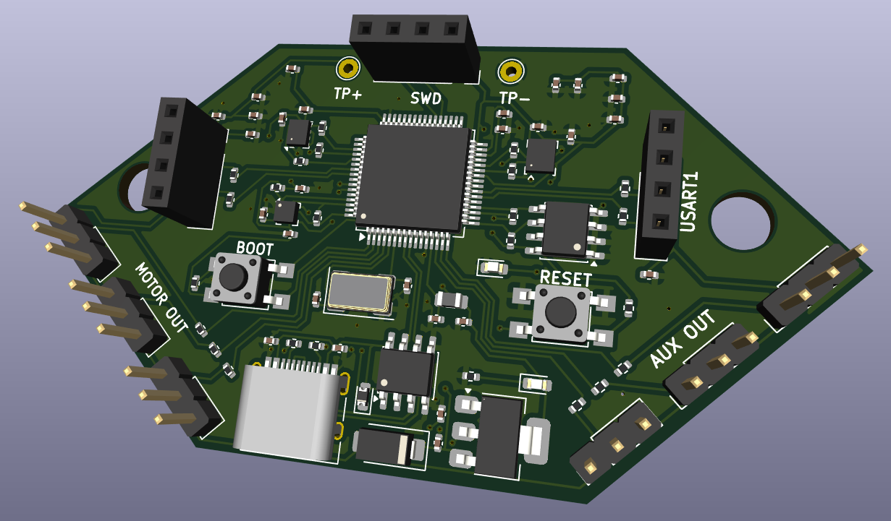

STM32 Flight Controller
A compact STM32-based flight controller designed for UAV and embedded flight-control applications. The board integrates an STM32F411 MCU, IMU, magnetometer, barometer, microSD storage, EEPROM, USB-C, SWD debugging, and multiple motor/auxiliary outputs.
---
Overview
This project implements a custom flight controller designed in KiCad around the STM32F411RET6 microcontroller.
The board combines the main sensors and interfaces required for embedded flight-control and UAV applications into a compact two-layer PCB.
---
3D Render

Adding the 3D Render to the Repository
Save the rendered image as `flight\_controller\_3d.png`.
Place it in the root folder of your GitHub repository.
Reference it in `README.md` using:
```markdown
!\[Flight Controller 3D Render](flight\_controller\_3d.png)
```
If the image is inside an `images` folder, use:
```markdown
!\[Flight Controller 3D Render](images/flight\_controller\_3d.png)
```
---
Features
STM32F411RET6 ARM Cortex-M4 microcontroller
LSM6DS3 6-axis IMU
LIS3MDL 3-axis magnetometer
BMP280 barometric pressure sensor
AT24C256A I²C EEPROM
MicroSD card interface
USB Type-C interface
SWD programming/debugging
BOOT and RESET buttons
3 motor outputs
3 auxiliary outputs
UART1 and UART2 interfaces
3.3 V regulated power supply
Compact 2-layer PCB
Designed using KiCad
---
Hardware Architecture
```text
             USB Type-C
                  │
                  ▼
             Power Supply
                  │
                  ▼
           STM32F411RET6
                  │
      ┌───────────┼───────────┐
      ▼           ▼           ▼
     IMU        Barometer   Magnetometer
   LSM6DS3       BMP280       LIS3MDL
      │
      ├──────────► EEPROM
      │
      ├──────────► MicroSD
      │
      ├──────────► UART1 / UART2
      │
      └──────────► Motor / AUX Outputs
```
---
Main Components
Microcontroller
STM32F411RET6 — main processing unit responsible for sensor acquisition, flight-control processing, communication, and output generation.
Sensors
LSM6DS3 — 3-axis accelerometer + 3-axis gyroscope
LIS3MDL — 3-axis magnetometer
BMP280 — barometric pressure sensor
Storage
AT24C256A — non-volatile I²C EEPROM
MicroSD — flight-data and logging storage
Interfaces
USB Type-C
SWD
UART1
UART2
3 × Motor outputs
3 × Auxiliary outputs
---
PCB Design
Designed in KiCad with a compact two-layer layout.
Design considerations include:
Dedicated ground routing
Local sensor decoupling
Compact MCU placement
Short peripheral connections
Accessible SWD interface
External motor and auxiliary connectors
USB-C connectivity
Onboard test points
---
Applications
UAV flight controllers
Drone development
Autonomous aerial vehicles
Flight-data logging
Sensor-fusion experiments
Embedded control systems
UAV hardware prototyping
---
Future Improvements
CAN interface
GPS interface
Battery voltage/current monitoring
Additional motor outputs
Dedicated telemetry interface
Receiver interface
Buzzer/status indicators
Additional IMU
Improved power protection
---
Tools Used
KiCad
STM32F411RET6
STM32CubeIDE
I²C
SPI
USART
USB
SWD
---
License
This project is open-source and intended for educational, research, and UAV hardware-development purposes.
